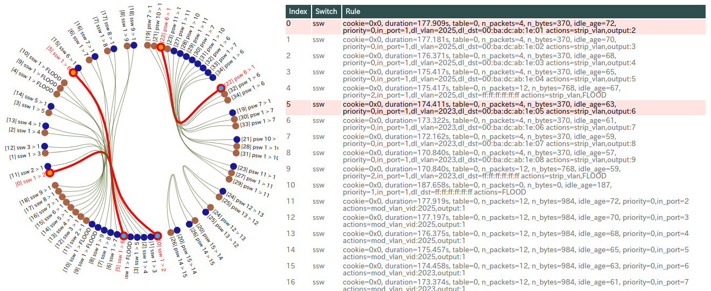

# nettester_flowviewer
Visualize OVS flow table under [NetTester](https://github.com/net-tester/net-tester) control to debug.

## Installation/Requirement
- Clone or [Download/Unzip](https://github.com/corestate55/nettester_flowviewer/archive/develop.zip) this repos.
- Open [index.html](./index.html)
  - Use chrome (tested with chromium 59 on ubuntu16.04)
    or other browser that can work with [D3.js (v4)](https://d3js.org/).
  - This repos does not contain d3.js. So it needs internet connection to download it.

## Usage
1. Run [NetTester](https://github.com/net-tester/net-tester) as you like.
2. Get flow table of each OVS (SSW and PSW), with command `ovs-ofctl dump-flows`.
3. Copy and paste the dumped texts into each corresponded textbox.
4. Clink "(Re)Draw" button.

This application visualize and highlight correspond flow entries in each switches
as a graph and a flow table by "mouse-over".

## Sample
Flow rules included [index.html](./index.html) are installed by [NetTester](https://github.com/net-tester/net-tester) controller,
with [sample script (example2.rb)](https://gist.github.com/corestate55/91dd3e4dc54e858082ca082a4270c004#file-example2-rb)

This tool visualize flow rules like below.

